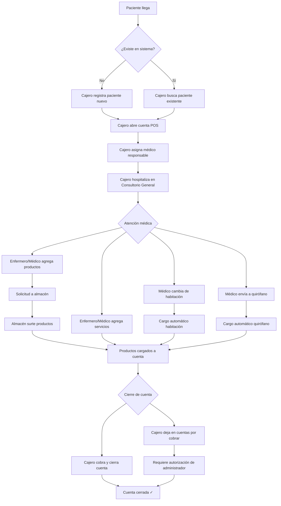
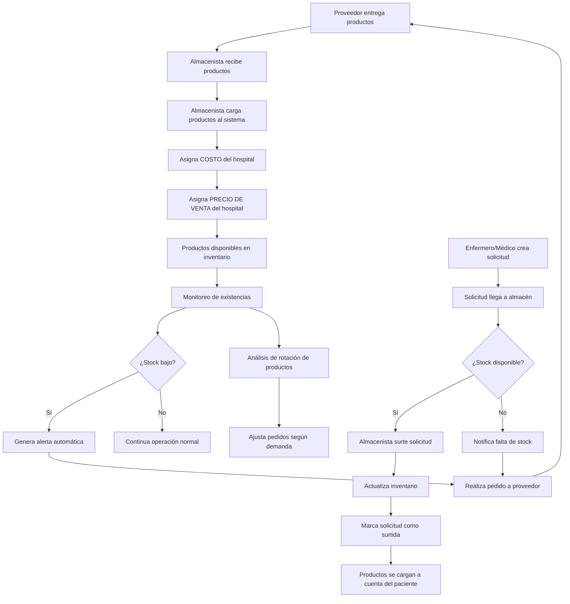
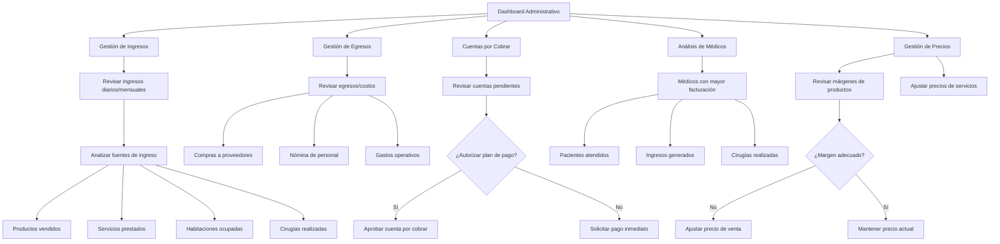

# FLUJOS DE TRABAJO CRÍTICOS DEL SISTEMA
**Sistema de Gestión Hospitalaria Integral**
**Desarrollador:** Alfredo Manuel Reyes - AGNT
**Fecha:** 6 de noviembre de 2025

---

## 🎯 OBJETIVO

Este documento define los **3 flujos de trabajo imprescindibles** del sistema hospitalario que DEBEN estar implementados y funcionales para considerarse production-ready.

---

## 📋 FLUJO 1: CAJERO - Gestión de Pacientes y Cuentas

### Descripción
El cajero es el punto de entrada principal para pacientes. Gestiona el registro, hospitalización inicial, y cierre de cuentas.

### Rol del Sistema: `cajero`

### Flujo Completo



### Pasos Detallados

#### 1. **Registro/Búsqueda de Paciente**
- **Actor:** Cajero
- **Módulo:** Pacientes
- **Acciones:**
  - Buscar paciente existente por nombre, CURP, o número de expediente
  - Si NO existe: Registrar nuevo paciente con datos completos
  - Si existe: Validar identidad y abrir historial

**Endpoints requeridos:**
- `GET /api/patients?search={query}` - Búsqueda
- `POST /api/patients` - Crear nuevo
- `GET /api/patients/:id` - Ver detalles

**Pantallas requeridas:**
- `/patients` - Lista y búsqueda
- `/patients/new` - Formulario de registro

---

#### 2. **Apertura de Cuenta POS**
- **Actor:** Cajero
- **Módulo:** POS (Punto de Venta)
- **Acciones:**
  - Crear cuenta POS nueva para el paciente
  - Estado inicial: `abierta`
  - Saldo inicial: $0.00

**Endpoints requeridos:**
- `POST /api/pos/accounts` - Crear cuenta

**Datos requeridos:**
```json
{
  "pacienteId": 123,
  "estado": "abierta",
  "saldo": 0.0,
  "usuarioId": 456  // Cajero que abre la cuenta
}
```

**Pantallas requeridas:**
- `/pos` - Gestión de cuentas

---

#### 3. **Asignación de Médico Responsable**
- **Actor:** Cajero
- **Módulo:** Empleados (Médicos)
- **Acciones:**
  - Seleccionar médico responsable de lista de médicos activos
  - Asignar como médico tratante principal

**Endpoints requeridos:**
- `GET /api/employees/doctors` - Lista de médicos activos

**Datos requeridos:**
- `medicoId` - ID del médico asignado

---

#### 4. **Hospitalización en Consultorio General**
- **Actor:** Cajero
- **Módulo:** Hospitalización + Habitaciones
- **Regla Crítica:** ⚠️ **Consultorio General NO genera cargo por habitación**
- **Acciones:**
  - Crear registro de hospitalización
  - Asignar habitación tipo "Consultorio General"
  - Estado: `activo`
  - Anticipo: **$10,000 MXN** (automático)

**Endpoints requeridos:**
- `POST /api/hospitalization/admissions` - Crear ingreso
- `GET /api/rooms?tipo=consultorio_general&disponible=true` - Consultorios disponibles

**Datos requeridos:**
```json
{
  "pacienteId": 123,
  "habitacionId": 1,  // Consultorio General
  "medicoId": 456,
  "motivoIngreso": "Atención médica general",
  "diagnosticoInicial": "Por determinar",
  "anticipo": 10000.0,  // AUTOMÁTICO
  "estadoHospitalizacion": "activo"
}
```

**Validaciones:**
- ✅ Habitación tipo "Consultorio General" debe existir
- ✅ Habitación debe estar disponible
- ✅ **Consultorio General NO debe generar cargos automáticos**
- ✅ Anticipo de $10,000 MXN se carga automáticamente

**Pantallas requeridas:**
- `/hospitalization` - Gestión de ingresos
- Debe mostrar consultorio general disponible

---

#### 5. **Agregado de Productos por Enfermero/Médico**
- **Actores:** Enfermero, Médico Residente, Médico Especialista
- **Módulo:** POS + Solicitudes + Inventario
- **Acciones:**
  1. Seleccionar cuenta del paciente
  2. Agregar productos necesarios (medicamentos, insumos, etc.)
  3. Sistema genera **solicitud automática al almacén**
  4. Almacén surte productos
  5. Productos se cargan a cuenta del paciente

**Endpoints requeridos:**
- `POST /api/solicitudes` - Crear solicitud de productos
- `GET /api/inventory/products` - Lista de productos disponibles
- `POST /api/pos/accounts/:id/add-item` - Agregar producto a cuenta

**Flujo de Solicitud:**
```json
// 1. Enfermero crea solicitud
POST /api/solicitudes
{
  "solicitanteId": 789,  // Enfermero/Médico
  "departamento": "enfermeria",
  "items": [
    {
      "productoId": 101,
      "cantidad": 5,
      "urgencia": "media"
    }
  ]
}

// 2. Almacén surte
PUT /api/solicitudes/:id/status
{
  "nuevoEstado": "surtida"
}

// 3. Sistema carga a cuenta automáticamente
POST /api/pos/accounts/:cuentaId/add-item
{
  "productoId": 101,
  "cantidad": 5,
  "precio": 150.0  // Precio de venta del hospital
}
```

**Validaciones:**
- ✅ Solo roles autorizados pueden solicitar productos (enfermero, médicos)
- ✅ Productos deben tener stock disponible
- ✅ Precio de venta (no costo) se carga a cuenta del paciente

**Pantallas requeridas:**
- `/solicitudes` - Gestión de solicitudes
- `/pos` - Agregar productos a cuenta

---

#### 6. **Agregado de Servicios por Enfermero/Médico**
- **Actores:** Enfermero, Médico Residente, Médico Especialista
- **Módulo:** POS + Servicios
- **Acciones:**
  - Agregar servicios médicos a cuenta (consultas, procedimientos, estudios)
  - Servicios se cargan inmediatamente a cuenta

**Endpoints requeridos:**
- `GET /api/inventory/services` - Lista de servicios disponibles
- `POST /api/pos/accounts/:id/add-service` - Agregar servicio a cuenta

**Datos requeridos:**
```json
{
  "servicioId": 201,
  "cantidad": 1,
  "precio": 500.0,  // Precio del servicio
  "descripcion": "Consulta médica especializada"
}
```

**Pantallas requeridas:**
- `/pos` - Agregar servicios a cuenta

---

#### 7. **Cambio de Habitación**
- **Actores:** Médico Residente, Médico Especialista
- **Módulo:** Hospitalización + Habitaciones
- **Acciones:**
  - Cambiar paciente de Consultorio General a habitación estándar/premium
  - **Habitaciones generan cargo automático diario**
  - Registrar fecha/hora de cambio

**Endpoints requeridos:**
- `PUT /api/hospitalization/:id/change-room` - Cambiar habitación
- `GET /api/rooms?disponible=true` - Habitaciones disponibles

**Datos requeridos:**
```json
{
  "nuevaHabitacionId": 5,
  "motivo": "Requiere observación extendida"
}
```

**Reglas de Negocio:**
- ✅ **Consultorio General → Habitación:** Inicia cargo automático
- ✅ **Habitación → Otra Habitación:** Cargo se ajusta al nuevo precio
- ✅ Cargo diario se genera automáticamente a las 00:00
- ✅ Se registra en `servicio_habitacion`

**Pantallas requeridas:**
- `/hospitalization` - Cambiar habitación

---

#### 8. **Envío a Quirófano**
- **Actores:** Médico Residente, Médico Especialista
- **Módulo:** Quirófanos + Cirugías
- **Acciones:**
  - Programar cirugía en quirófano disponible
  - **Quirófano genera cargo automático al completar cirugía**
  - Asignar médico cirujano, anestesiólogo, enfermeros

**Endpoints requeridos:**
- `POST /api/quirofanos/cirugias` - Programar cirugía
- `GET /api/quirofanos?disponible=true` - Quirófanos disponibles

**Datos requeridos:**
```json
{
  "quirofanoId": 3,
  "pacienteId": 123,
  "hospitalizacionId": 456,
  "medicoCirujanoId": 789,
  "tipoCirugia": "Apendicectomía",
  "fechaProgramada": "2025-11-07T10:00:00",
  "tiempoEstimado": 120  // minutos
}
```

**Reglas de Negocio:**
- ✅ Al completar cirugía, se genera cargo automático
- ✅ Cargo incluye: uso de quirófano + tiempo + insumos
- ✅ Se registra en `servicio_quirofano`

**Pantallas requeridas:**
- `/quirofanos` - Gestión de quirófanos
- `/quirofanos/cirugias` - Programar cirugía

---

#### 9. **Cierre de Cuenta (Cobro Final)**
- **Actor:** Cajero
- **Módulo:** POS + Facturación
- **Acciones:**
  - Revisar cuenta completa del paciente
  - Calcular total (productos + servicios + habitación + quirófano)
  - Restar anticipo ($10,000)
  - Cobrar saldo pendiente
  - Cerrar cuenta
  - Generar factura (opcional)

**Endpoints requeridos:**
- `GET /api/pos/accounts/:id` - Ver cuenta completa
- `POST /api/pos/accounts/:id/close` - Cerrar cuenta
- `POST /api/billing/invoices` - Generar factura

**Datos requeridos:**
```json
{
  "metodoPago": "efectivo",  // efectivo, tarjeta, transferencia
  "montoPagado": 5000.0,
  "facturar": true,  // Generar factura
  "datosFacturacion": {
    "rfc": "XAXX010101000",
    "razonSocial": "Paciente Ejemplo"
  }
}
```

**Cálculo de Cuenta:**
```
Total = Σ(Productos) + Σ(Servicios) + Σ(Habitación) + Σ(Quirófano)
Anticipo = -$10,000
Saldo = Total - Anticipo
```

**Pantallas requeridas:**
- `/pos` - Cerrar cuenta
- `/billing` - Generar factura

---

#### 10. **Cuentas por Cobrar (Alternativa)**
- **Actor:** Cajero (requiere autorización de Administrador)
- **Módulo:** POS + Facturación
- **Acciones:**
  - Si paciente no puede pagar saldo completo
  - Cajero solicita autorización al Administrador
  - Se deja cuenta en estado `cuentas_por_cobrar`
  - Se programa plan de pago

**Endpoints requeridos:**
- `PUT /api/pos/accounts/:id/status` - Cambiar a cuentas por cobrar
- `GET /api/billing/accounts-receivable` - Lista de cuentas por cobrar

**Datos requeridos:**
```json
{
  "nuevoEstado": "cuentas_por_cobrar",
  "autorizadoPor": 999,  // ID del administrador
  "observaciones": "Paciente solicita plan de pago a 3 meses",
  "montoPendiente": 5000.0
}
```

**Validaciones:**
- ✅ Requiere rol `administrador` para autorizar
- ✅ Se registra en auditoría
- ✅ Aparece en reporte de cuentas por cobrar

**Pantallas requeridas:**
- `/billing/accounts-receivable` - Gestión de cuentas por cobrar

---

### Permisos Requeridos (Rol: `cajero`)

| Acción | Endpoint | Permiso |
|--------|----------|---------|
| Ver/Buscar pacientes | GET /api/patients | ✅ Lectura |
| Crear paciente | POST /api/patients | ✅ Crear |
| Abrir cuenta | POST /api/pos/accounts | ✅ Crear |
| Ver médicos | GET /api/employees/doctors | ✅ Lectura |
| Crear hospitalización | POST /api/hospitalization/admissions | ✅ Crear |
| Ver habitaciones | GET /api/rooms | ✅ Lectura |
| Cerrar cuenta | POST /api/pos/accounts/:id/close | ✅ Actualizar |
| Ver cuentas por cobrar | GET /api/billing/accounts-receivable | ✅ Lectura |
| Generar factura | POST /api/billing/invoices | ✅ Crear |

---

## 📦 FLUJO 2: ALMACÉN - Gestión de Inventario y Solicitudes

### Descripción
El almacenista gestiona la entrada de productos, asignación de costos/precios, surtido de solicitudes, y control de existencias.

### Rol del Sistema: `almacenista`

### Flujo Completo



### Pasos Detallados

#### 1. **Recepción de Productos del Proveedor**
- **Actor:** Almacenista
- **Módulo:** Inventario + Proveedores
- **Acciones:**
  - Recibir productos físicamente
  - Verificar cantidad y calidad
  - Registrar entrada en sistema

**Endpoints requeridos:**
- `GET /api/inventory/suppliers` - Lista de proveedores
- `POST /api/inventory/movements` - Registrar entrada

**Datos requeridos:**
```json
{
  "tipo": "entrada",
  "proveedorId": 10,
  "items": [
    {
      "productoId": 101,
      "cantidad": 100,
      "lote": "LOT-2025-001",
      "fechaVencimiento": "2026-11-01"
    }
  ],
  "observaciones": "Recepción completa sin daños"
}
```

**Pantallas requeridas:**
- `/inventory/movements` - Registrar movimiento de entrada

---

#### 2. **Carga de Productos al Sistema**
- **Actor:** Almacenista
- **Módulo:** Inventario (Productos)
- **Acciones:**
  - Si producto es NUEVO: Crear registro en catálogo
  - Si producto EXISTE: Actualizar existencias
  - Asignar información completa del producto

**Endpoints requeridos:**
- `POST /api/inventory/products` - Crear producto nuevo
- `PUT /api/inventory/products/:id` - Actualizar producto existente

**Datos de Producto Nuevo:**
```json
{
  "codigo": "MED-PARACET-500",
  "nombre": "Paracetamol 500mg",
  "descripcion": "Analgésico y antipirético",
  "categoria": "medicamentos",
  "unidadMedida": "tableta",
  "proveedorId": 10,
  "stockMinimo": 50,
  "stockMaximo": 500
}
```

**Pantallas requeridas:**
- `/inventory/products` - CRUD de productos

---

#### 3. **Asignación de COSTO (lo que paga el hospital)**
- **Actor:** Almacenista
- **Módulo:** Inventario (Productos)
- **Regla Crítica:** ⚠️ **COSTO = Precio que el hospital PAGA al proveedor**
- **Acciones:**
  - Registrar costo de compra unitario
  - Este valor NO es visible para pacientes
  - Se usa para cálculo de rentabilidad

**Campo requerido:**
```json
{
  "costo": 15.50  // MXN por unidad (precio de compra)
}
```

**Validaciones:**
- ✅ Costo debe ser mayor a 0
- ✅ Solo almacenista y administrador pueden ver/editar costo
- ✅ Se registra historial de cambios de costo

---

#### 4. **Asignación de PRECIO DE VENTA (lo que cobra el hospital)**
- **Actor:** Almacenista (con autorización de Administrador para cambios)
- **Módulo:** Inventario (Productos)
- **Regla Crítica:** ⚠️ **PRECIO DE VENTA = Precio que el hospital COBRA al paciente**
- **Acciones:**
  - Calcular margen de ganancia
  - Asignar precio de venta al público
  - Este precio se carga a cuenta del paciente

**Campo requerido:**
```json
{
  "precio": 35.00  // MXN por unidad (precio de venta)
}
```

**Validaciones:**
- ✅ Precio de venta debe ser mayor que costo
- ✅ Margen de ganancia: `(precio - costo) / costo * 100`
- ✅ Cambios de precio requieren autorización si margen <20%

**Ejemplo de Rentabilidad:**
```
Costo:          $15.50
Precio Venta:   $35.00
Ganancia:       $19.50
Margen:         125.8%
```

---

#### 5. **Revisión de Solicitudes de Productos**
- **Actor:** Almacenista
- **Módulo:** Solicitudes
- **Acciones:**
  - Ver solicitudes pendientes de enfermería/médicos
  - Priorizar por urgencia
  - Verificar stock disponible
  - Surte o notifica falta de stock

**Endpoints requeridos:**
- `GET /api/solicitudes?estado=pendiente` - Solicitudes pendientes
- `GET /api/solicitudes/:id` - Detalle de solicitud
- `PUT /api/solicitudes/:id/status` - Actualizar estado

**Estados de Solicitud:**
- `pendiente` - Recién creada
- `en_proceso` - Almacenista la está surtiendo
- `surtida` - Completada
- `cancelada` - No se pudo surtar

**Pantallas requeridas:**
- `/solicitudes` - Lista de solicitudes pendientes

---

#### 6. **Surtido de Solicitudes**
- **Actor:** Almacenista
- **Módulo:** Solicitudes + Inventario
- **Acciones:**
  - Retirar productos del inventario físico
  - Registrar salida en sistema (movimiento de inventario)
  - Actualizar stock
  - Marcar solicitud como surtida
  - Entregar productos a enfermería/médicos

**Endpoints requeridos:**
- `POST /api/inventory/movements` - Registrar salida
- `PUT /api/solicitudes/:id/surte` - Marcar como surtida

**Datos de Salida:**
```json
{
  "tipo": "salida",
  "solicitudId": 123,
  "items": [
    {
      "productoId": 101,
      "cantidad": 5,
      "precioVenta": 35.00  // Se carga a cuenta del paciente
    }
  ],
  "observaciones": "Surtido completo a enfermería"
}
```

**Validaciones:**
- ✅ Stock suficiente antes de surtar
- ✅ Stock se decrementa automáticamente
- ✅ Productos se cargan automáticamente a cuenta del paciente

---

#### 7. **Mantenimiento de Existencias**
- **Actor:** Almacenista
- **Módulo:** Inventario + Alertas
- **Acciones:**
  - Monitorear niveles de stock diariamente
  - Revisar alertas automáticas de stock bajo
  - Realizar conteos físicos periódicos
  - Ajustar inventario si hay discrepancias

**Endpoints requeridos:**
- `GET /api/inventory/alerts` - Alertas de stock bajo
- `GET /api/inventory/products?stockBajo=true` - Productos con stock bajo
- `POST /api/inventory/movements` - Ajuste de inventario

**Alertas Automáticas:**
```javascript
// El sistema genera alertas cuando:
if (stockActual <= stockMinimo) {
  crearAlerta({
    tipo: "stock_bajo",
    productoId: producto.id,
    stockActual: producto.stock,
    stockMinimo: producto.stockMinimo,
    accionSugerida: "Realizar pedido urgente"
  });
}
```

**Pantallas requeridas:**
- `/inventory` - Dashboard de inventario con alertas
- `/inventory/alerts` - Gestión de alertas

---

#### 8. **Análisis de Rotación de Productos**
- **Actor:** Almacenista
- **Módulo:** Reportes + Inventario
- **Acciones:**
  - Analizar productos más vendidos
  - Identificar productos de baja rotación
  - Ajustar pedidos según demanda
  - Optimizar niveles de stock

**Endpoints requeridos:**
- `GET /api/reports/inventory-rotation` - Reporte de rotación
- `GET /api/inventory/products/top-selling` - Productos más vendidos
- `GET /api/inventory/products/slow-moving` - Productos de baja rotación

**Métricas de Rotación:**
```
Rotación = Ventas del período / Stock promedio
Alta rotación: >12 veces/año (mensual)
Media rotación: 6-12 veces/año (bimestral)
Baja rotación: <6 veces/año (trimestral+)
```

**Pantallas requeridas:**
- `/reports` - Reportes de inventario
- Dashboard con gráficas de rotación

---

### Permisos Requeridos (Rol: `almacenista`)

| Acción | Endpoint | Permiso |
|--------|----------|---------|
| Ver productos | GET /api/inventory/products | ✅ Lectura |
| Crear producto | POST /api/inventory/products | ✅ Crear |
| Actualizar producto | PUT /api/inventory/products/:id | ✅ Actualizar |
| Ver/editar COSTO | PUT /api/inventory/products/:id | ✅ Actualizar |
| Ver/editar PRECIO | PUT /api/inventory/products/:id | ✅ Actualizar |
| Ver proveedores | GET /api/inventory/suppliers | ✅ Lectura |
| Registrar movimientos | POST /api/inventory/movements | ✅ Crear |
| Ver solicitudes | GET /api/solicitudes | ✅ Lectura |
| Surtar solicitudes | PUT /api/solicitudes/:id/surte | ✅ Actualizar |
| Ver alertas | GET /api/inventory/alerts | ✅ Lectura |
| Ver reportes rotación | GET /api/reports/inventory-rotation | ✅ Lectura |
| Consulta general sistema | GET /api/** | ✅ Lectura |

---

## 💼 FLUJO 3: ADMINISTRADOR - Gestión Financiera y Estratégica

### Descripción
El administrador gestiona la parte financiera y estratégica del hospital: ingresos, egresos, cuentas por cobrar, análisis de médicos, y gestión de costos/precios.

### Rol del Sistema: `administrador`

### Flujo Completo



### Pasos Detallados

#### 1. **Gestión de Ingresos**
- **Actor:** Administrador
- **Módulo:** Reportes + Facturación
- **Acciones:**
  - Revisar ingresos diarios/semanales/mensuales/anuales
  - Analizar fuentes de ingreso (productos, servicios, habitaciones, quirófanos)
  - Comparar períodos (mes actual vs mes anterior)
  - Identificar tendencias

**Endpoints requeridos:**
- `GET /api/reports/financial?tipo=ingresos&periodo=mes` - Reporte de ingresos
- `GET /api/billing/stats` - Estadísticas de facturación
- `GET /api/reports/income-sources` - Fuentes de ingreso desglosadas

**Métricas Clave:**
```javascript
{
  "ingresosTotales": 500000.0,  // MXN del período
  "desglose": {
    "productos": 200000.0,      // 40%
    "servicios": 150000.0,      // 30%
    "habitaciones": 100000.0,   // 20%
    "quirofanos": 50000.0       // 10%
  },
  "comparacion": {
    "mesAnterior": 450000.0,
    "crecimiento": 11.1         // % de crecimiento
  }
}
```

**Pantallas requeridas:**
- `/reports` - Dashboard de reportes financieros
- `/reports/income` - Análisis detallado de ingresos

---

#### 2. **Gestión de Egresos**
- **Actor:** Administrador
- **Módulo:** Reportes + Inventario
- **Acciones:**
  - Revisar egresos/costos del hospital
  - Analizar compras a proveedores
  - Monitorear gastos operativos
  - Calcular utilidad neta

**Endpoints requeridos:**
- `GET /api/reports/financial?tipo=egresos&periodo=mes` - Reporte de egresos
- `GET /api/inventory/movements?tipo=entrada` - Compras realizadas
- `GET /api/reports/expenses` - Gastos operativos

**Métricas Clave:**
```javascript
{
  "egresosTotales": 300000.0,  // MXN del período
  "desglose": {
    "comprasInventario": 180000.0,  // 60%
    "nomina": 100000.0,             // 33%
    "gastosOperativos": 20000.0     // 7%
  },
  "utilidadNeta": 200000.0,         // Ingresos - Egresos
  "margenUtilidad": 40.0            // % de utilidad
}
```

**Pantallas requeridas:**
- `/reports/expenses` - Análisis de egresos

---

#### 3. **Cuentas por Cobrar**
- **Actor:** Administrador
- **Módulo:** Facturación + Cuentas por Cobrar
- **Acciones:**
  - Revisar cuentas pendientes de pago
  - Autorizar planes de pago solicitados por cajeros
  - Dar seguimiento a cobros
  - Gestionar cuentas vencidas

**Endpoints requeridos:**
- `GET /api/billing/accounts-receivable` - Lista de cuentas por cobrar
- `PUT /api/billing/accounts-receivable/:id/authorize` - Autorizar plan de pago
- `GET /api/billing/overdue-accounts` - Cuentas vencidas

**Datos de Cuenta por Cobrar:**
```json
{
  "id": 456,
  "pacienteId": 123,
  "montoPendiente": 5000.0,
  "fechaVencimiento": "2025-12-01",
  "estadoPago": "pendiente",  // pendiente, parcial, vencida
  "planPago": {
    "cuotas": 3,
    "montoCuota": 1666.67,
    "frecuencia": "mensual"
  },
  "autorizadoPor": null  // ID del administrador
}
```

**Acciones de Autorización:**
```javascript
// Administrador autoriza plan de pago
PUT /api/billing/accounts-receivable/:id/authorize
{
  "autorizadoPor": 999,  // ID del administrador
  "aprobado": true,
  "observaciones": "Aprobado plan de pago a 3 meses"
}
```

**Pantallas requeridas:**
- `/billing/accounts-receivable` - Gestión de cuentas por cobrar
- Dashboard con alertas de cuentas vencidas

---

#### 4. **Análisis de Médicos con Mayor Participación**
- **Actor:** Administrador
- **Módulo:** Reportes + Empleados
- **Acciones:**
  - Identificar médicos con mayor facturación
  - Analizar pacientes atendidos por médico
  - Revisar ingresos generados por médico
  - Evaluar cirugías realizadas por médico

**Endpoints requeridos:**
- `GET /api/reports/top-doctors?periodo=mes` - Médicos top del período
- `GET /api/reports/doctor-performance/:id` - Performance de médico específico
- `GET /api/employees/doctors?orderBy=ingresos` - Médicos ordenados por ingresos

**Métricas de Médico:**
```javascript
{
  "medicoId": 456,
  "nombre": "Dr. Juan Pérez",
  "especialidad": "Cirugía General",
  "estadisticas": {
    "pacientesAtendidos": 45,
    "ingresosGenerados": 150000.0,  // MXN
    "cirugiasRealizadas": 12,
    "promedioIngresoPorPaciente": 3333.33,
    "ranking": 1  // Top 1 del mes
  }
}
```

**Análisis Comparativo:**
```javascript
{
  "topMedicos": [
    {
      "medicoId": 456,
      "nombre": "Dr. Juan Pérez",
      "ingresos": 150000.0,
      "participacion": 30.0  // % del total de ingresos
    },
    {
      "medicoId": 789,
      "nombre": "Dra. María García",
      "ingresos": 120000.0,
      "participacion": 24.0
    }
    // ... top 10
  ]
}
```

**Pantallas requeridas:**
- `/reports/doctors` - Análisis de médicos
- Dashboard con ranking de médicos

---

#### 5. **Gestión de Costos y Precios de Productos**
- **Actor:** Administrador
- **Módulo:** Inventario
- **Acciones:**
  - Revisar márgenes de ganancia de productos
  - Identificar productos con margen bajo
  - Ajustar precios de venta si es necesario
  - Negociar mejores costos con proveedores

**Endpoints requeridos:**
- `GET /api/inventory/products?orderBy=margen` - Productos por margen
- `PUT /api/inventory/products/:id/price` - Ajustar precio (requiere admin)
- `GET /api/reports/product-profitability` - Rentabilidad de productos

**Análisis de Margen:**
```javascript
{
  "productoId": 101,
  "nombre": "Paracetamol 500mg",
  "costo": 15.50,
  "precioVenta": 35.00,
  "margen": 125.8,  // % (precio - costo) / costo * 100
  "ventasMes": 500,  // unidades
  "utilidadMes": 9750.0  // (precio - costo) * ventas
}
```

**Alertas de Margen Bajo:**
```javascript
// Productos con margen <20% requieren revisión
if (margen < 20) {
  generarAlerta({
    tipo: "margen_bajo",
    productoId: producto.id,
    margenActual: margen,
    accionSugerida: "Ajustar precio o negociar costo"
  });
}
```

**Pantallas requeridas:**
- `/inventory/products` - CRUD con vista de márgenes
- `/reports/profitability` - Análisis de rentabilidad

---

#### 6. **Gestión de Precios de Servicios**
- **Actor:** Administrador
- **Módulo:** Inventario (Servicios)
- **Acciones:**
  - Revisar precios de servicios médicos
  - Ajustar precios según costos operativos
  - Comparar con precios de mercado
  - Actualizar catálogo de servicios

**Endpoints requeridos:**
- `GET /api/inventory/services` - Lista de servicios
- `PUT /api/inventory/services/:id/price` - Ajustar precio de servicio

**Datos de Servicio:**
```json
{
  "servicioId": 201,
  "nombre": "Consulta Médica Especializada",
  "precio": 500.0,
  "duracion": 30,  // minutos
  "costosAsociados": {
    "personal": 200.0,      // Honorario médico
    "insumos": 50.0,        // Materiales
    "operativos": 100.0     // Luz, agua, renta
  },
  "margen": 42.8  // % de ganancia
}
```

**Pantallas requeridas:**
- `/inventory/services` - CRUD de servicios con precios

---

### Permisos Requeridos (Rol: `administrador`)

| Acción | Endpoint | Permiso |
|--------|----------|---------|
| **ACCESO COMPLETO** | ALL /api/** | ✅ CRUD Completo |
| Ver reportes financieros | GET /api/reports/** | ✅ Lectura |
| Autorizar cuentas por cobrar | PUT /api/billing/accounts-receivable/:id/authorize | ✅ Actualizar |
| Ajustar precios productos | PUT /api/inventory/products/:id/price | ✅ Actualizar |
| Ajustar precios servicios | PUT /api/inventory/services/:id/price | ✅ Actualizar |
| Ver análisis de médicos | GET /api/reports/top-doctors | ✅ Lectura |
| Gestionar usuarios | ALL /api/users/** | ✅ CRUD Completo |

---

## 📊 REQUERIMIENTO ADICIONAL: Tabla de Ocupación en Tiempo Real

### Descripción
**TODOS los roles** deben ver en su página principal (dashboard) una **tabla de ocupación en tiempo real** mostrando el estado de consultorios, habitaciones y quirófanos.

### Aplica a Todos los Roles
- ✅ `administrador`
- ✅ `cajero`
- ✅ `enfermero`
- ✅ `almacenista`
- ✅ `medico_residente`
- ✅ `medico_especialista`
- ✅ `socio`

### Componentes de la Tabla

#### 1. **Consultorio General**
```javascript
{
  "tipo": "consultorio_general",
  "numero": 1,
  "estado": "ocupado",  // ocupado, disponible
  "pacienteActual": {
    "nombre": "Juan Pérez López",
    "expediente": "PAC-2025-001",
    "fechaIngreso": "2025-11-06T08:00:00"
  },
  "medicoAsignado": "Dr. Carlos Ramírez"
}
```

#### 2. **Habitaciones**
```javascript
{
  "tipo": "habitacion",
  "numero": 5,
  "piso": 2,
  "tipoHabitacion": "estandar",  // estandar, premium, suite
  "estado": "ocupado",  // ocupado, disponible, mantenimiento
  "pacienteActual": {
    "nombre": "María García Sánchez",
    "expediente": "PAC-2025-002",
    "fechaIngreso": "2025-11-05T14:30:00",
    "diasHospitalizado": 2
  },
  "medicoAsignado": "Dra. Ana Martínez",
  "precioDiario": 1500.0  // Solo visible para admin/cajero
}
```

#### 3. **Quirófanos**
```javascript
{
  "tipo": "quirofano",
  "numero": 3,
  "estado": "ocupado",  // disponible, ocupado, programado, mantenimiento
  "cirugiaActual": {
    "tipo": "Apendicectomía",
    "paciente": "Pedro Rodríguez",
    "medicoCircujano": "Dr. Juan Pérez",
    "horaInicio": "2025-11-06T10:00:00",
    "tiempoEstimado": 120,  // minutos
    "tiempoTranscurrido": 45  // minutos
  },
  "proximaCirugia": {
    "tipo": "Cesárea",
    "horaProgramada": "2025-11-06T13:00:00"
  }
}
```

### Endpoint Requerido
```
GET /api/dashboard/ocupacion
```

**Respuesta:**
```json
{
  "timestamp": "2025-11-06T11:30:00",
  "consultorioGeneral": {
    "total": 1,
    "ocupados": 1,
    "disponibles": 0,
    "detalle": [ /* array de consultorios */ ]
  },
  "habitaciones": {
    "total": 20,
    "ocupadas": 15,
    "disponibles": 4,
    "mantenimiento": 1,
    "detalle": [ /* array de habitaciones */ ]
  },
  "quirofanos": {
    "total": 5,
    "ocupados": 2,
    "disponibles": 2,
    "programados": 1,
    "detalle": [ /* array de quirófanos */ ]
  },
  "resumen": {
    "ocupacionTotal": 18,
    "capacidadTotal": 26,
    "porcentajeOcupacion": 69.2
  }
}
```

### Actualización en Tiempo Real
- **Opción 1:** Polling cada 30 segundos
  ```javascript
  setInterval(() => {
    fetchOcupacion();
  }, 30000);
  ```

- **Opción 2 (Futuro):** WebSockets para updates instantáneos
  ```javascript
  socket.on('ocupacion:updated', (data) => {
    updateOcupacionTable(data);
  });
  ```

### Diseño Visual

**Tabla de Ocupación (Dashboard):**
```
┌─────────────────────────────────────────────────────────────┐
│ 📊 OCUPACIÓN DEL HOSPITAL - Tiempo Real (11:30 AM)        │
├─────────────────────────────────────────────────────────────┤
│                                                             │
│ 🏥 CONSULTORIO GENERAL                                      │
│ ┌─────┬───────────┬────────────────┬──────────────┐        │
│ │ #   │ Estado    │ Paciente       │ Médico       │        │
│ ├─────┼───────────┼────────────────┼──────────────┤        │
│ │ 1   │ 🔴 Ocupado│ Juan Pérez     │ Dr. Ramírez  │        │
│ └─────┴───────────┴────────────────┴──────────────┘        │
│                                                             │
│ 🛏️ HABITACIONES (15/20 Ocupadas - 75%)                     │
│ ┌─────┬───────┬───────────┬────────────────┬──────────┐   │
│ │ #   │ Piso  │ Estado    │ Paciente       │ Días     │   │
│ ├─────┼───────┼───────────┼────────────────┼──────────┤   │
│ │ 5   │ 2     │ 🔴 Ocupado│ María García   │ 2 días   │   │
│ │ 6   │ 2     │ 🟢 Disp.  │ -              │ -        │   │
│ │ 7   │ 2     │ 🔴 Ocupado│ Pedro López    │ 1 día    │   │
│ └─────┴───────┴───────────┴────────────────┴──────────┘   │
│                                                             │
│ 🏥 QUIRÓFANOS (2/5 Ocupados - 40%)                          │
│ ┌─────┬───────────┬────────────────┬──────────────┐        │
│ │ #   │ Estado    │ Cirugía        │ Tiempo       │        │
│ ├─────┼───────────┼────────────────┼──────────────┤        │
│ │ 3   │ 🔴 En uso │ Apendicectomía │ 45/120 min   │        │
│ │ 4   │ 🟢 Disp.  │ -              │ -            │        │
│ │ 5   │ 🟡 Program│ Cesárea 13:00  │ Próxima      │        │
│ └─────┴───────────┴────────────────┴──────────────┘        │
│                                                             │
│ 📈 Ocupación Global: 18/26 espacios (69.2%)                │
└─────────────────────────────────────────────────────────────┘
```

### Implementación Frontend

**Componente:** `src/components/dashboard/OcupacionTable.tsx`

```typescript
import { useEffect, useState } from 'react';
import { ocupacionService } from '@/services/ocupacionService';

interface OcupacionData {
  consultorioGeneral: any;
  habitaciones: any;
  quirofanos: any;
  resumen: any;
}

export const OcupacionTable = () => {
  const [ocupacion, setOcupacion] = useState<OcupacionData | null>(null);

  useEffect(() => {
    const fetchOcupacion = async () => {
      const data = await ocupacionService.getOcupacion();
      setOcupacion(data);
    };

    // Cargar inicial
    fetchOcupacion();

    // Polling cada 30 segundos
    const interval = setInterval(fetchOcupacion, 30000);

    return () => clearInterval(interval);
  }, []);

  if (!ocupacion) return <div>Cargando ocupación...</div>;

  return (
    <div className="ocupacion-table">
      {/* Renderizar tabla según diseño */}
    </div>
  );
};
```

### Pantallas Requeridas
- `/dashboard` - Todos los roles deben ver esta tabla en su dashboard principal

---

## ✅ CHECKLIST DE IMPLEMENTACIÓN

### Flujo 1: Cajero ✓
- [ ] Registro/búsqueda de pacientes
- [ ] Apertura de cuenta POS
- [ ] Asignación de médico
- [ ] Hospitalización en Consultorio General (sin cargo)
- [ ] Anticipo automático $10,000 MXN
- [ ] Agregado de productos (con solicitud a almacén)
- [ ] Agregado de servicios
- [ ] Cambio de habitación (con cargo automático)
- [ ] Envío a quirófano (con cargo automático)
- [ ] Cierre de cuenta y cobro
- [ ] Cuentas por cobrar con autorización admin

### Flujo 2: Almacén ✓
- [ ] Recepción de productos de proveedores
- [ ] Carga de productos al sistema
- [ ] Asignación de COSTO (precio de compra)
- [ ] Asignación de PRECIO DE VENTA (precio al paciente)
- [ ] Revisión de solicitudes pendientes
- [ ] Surtido de solicitudes
- [ ] Actualización automática de inventario
- [ ] Monitoreo de existencias
- [ ] Alertas de stock bajo
- [ ] Análisis de rotación de productos

### Flujo 3: Administrador ✓
- [ ] Gestión de ingresos (reportes)
- [ ] Gestión de egresos (reportes)
- [ ] Cuentas por cobrar (autorización)
- [ ] Análisis de médicos top (facturación)
- [ ] Gestión de costos de productos
- [ ] Gestión de precios de productos
- [ ] Gestión de precios de servicios

### Requerimiento Adicional ✓
- [ ] Tabla de ocupación en tiempo real
- [ ] Endpoint GET /api/dashboard/ocupacion
- [ ] Componente OcupacionTable.tsx
- [ ] Visible en dashboard de TODOS los roles
- [ ] Actualización cada 30 segundos (polling)

---

## 🚀 PRIORIDADES DE VALIDACIÓN

### P0 (CRÍTICO) - Debe estar implementado
1. ✅ Anticipo automático $10,000 MXN
2. ✅ Consultorio General sin cargo por habitación
3. ✅ Cargos automáticos de habitaciones
4. ✅ Cargos automáticos de quirófanos
5. ✅ Diferencia entre COSTO y PRECIO DE VENTA en productos

### P1 (ALTO) - Debe validarse
1. ✅ Flujo completo cajero (registro → hospitalización → cobro)
2. ✅ Flujo completo almacén (recepción → surtido)
3. ✅ Tabla de ocupación en tiempo real

### P2 (MEDIO) - Mejora continua
1. ⚠️ Análisis de médicos top
2. ⚠️ Reportes financieros completos
3. ⚠️ Análisis de rotación de inventario

---

## 📝 NOTAS FINALES

**Autor:** Alfredo Manuel Reyes - AGNT
**Sistema:** Gestión Hospitalaria Integral
**Fecha:** 6 de noviembre de 2025
**Versión:** 1.0.0

**Este documento es la especificación OFICIAL de los flujos de trabajo críticos del sistema. Cualquier implementación DEBE cumplir con estos flujos para considerarse completa.**

---

*© 2025 AGNT: Infraestructura Tecnológica Empresarial e Inteligencia Artificial. Todos los derechos reservados.*
