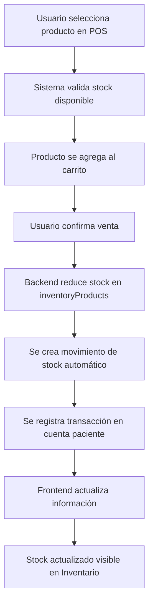

# 🔗 Resumen de Integración: POS ↔ Inventario

*Completado: ${new Date().toLocaleString('es-MX')}*

## 🎯 Objetivo Completado

Integrar completamente el módulo de Punto de Venta (POS) con el sistema de Inventario para lograr:
- Sincronización en tiempo real de stock
- Actualizaciones automáticas de inventario en ventas
- Trazabilidad completa de movimientos
- Información unificada de productos

## ✅ Implementaciones Realizadas

### 1. **Unificación de Fuentes de Datos**

#### Antes:
- POS usaba array `products` separado
- Inventario usaba array `inventoryProducts`
- Datos duplicados y desincronizados

#### Después:
- POS ahora usa `inventoryProducts` como fuente única
- Endpoints `/api/products` redirigen a `/api/inventory/products`
- Data source unificada y consistente

**Archivos modificados:**
- `backend/simple-server.js` (líneas 1471-1513, 1658-1688)
- `frontend/src/services/posService.ts`

### 2. **Actualizaciones Automáticas de Stock**

#### Funcionalidad:
```javascript
// Cuando se vende un producto en POS:
1. Valida stock disponible
2. Reduce inventoryProducts[index].stockActual
3. Crea movimiento de stock automático
4. Actualiza fechaActualizacion del producto
```

#### Detalles del Movimiento Automático:
```javascript
const newStockMovement = {
  tipoMovimiento: 'salida',
  cantidad: cantidadVendida,
  motivoMovimiento: `Venta POS - Cuenta #${accountId}`,
  usuario: req.user.username,
  numeroDocumento: `POS-${accountId}-${timestamp}`,
  observaciones: `Venta realizada por ${username} en POS`
}
```

### 3. **Filtrado Inteligente de Productos**

#### Nuevos Parámetros API:
- `stockMinimo`: Filtra productos con stock >= valor especificado
- POS usa `stockMinimo: 1` para mostrar solo productos disponibles

#### Endpoint mejorado:
```javascript
GET /api/inventory/products?stockMinimo=1&activo=true
// Retorna solo productos activos con stock disponible
```

### 4. **Interfaz de Usuario Mejorada**

#### POS Transaction Dialog:
- Indicadores de stock en tiempo real
- Alertas de "Stock Bajo" para productos cerca del mínimo
- Validación visual de disponibilidad

#### Código implementado:
```tsx
{searchType === 'producto' && (
  <>
    {` • Stock: ${product.stockActual}`}
    {product.stockActual <= product.stockMinimo && (
      <Typography variant="caption" color="warning.main">
        (Stock Bajo)
      </Typography>
    )}
  </>
)}
```

#### POS Main Page:
- Alert informativo sobre integración en tiempo real
- Notificación de sincronización automática

### 5. **Trazabilidad Completa**

#### Información registrada en cada venta:
- **Usuario que realizó la venta**
- **Timestamp exacto**
- **Número de documento único**
- **Cuenta de paciente asociada**
- **Cantidad y costo del producto**
- **Observaciones detalladas**

## 🔄 Flujo de Integración Completado



## 📊 Beneficios Logrados

### ✅ Para el POS:
- **Stock en tiempo real**: Nunca vender productos sin inventario
- **Información rica**: Códigos, proveedores, fechas de caducidad
- **Validación automática**: Prevención de sobreventa
- **Alertas inteligentes**: Notificaciones de stock bajo

### ✅ Para el Inventario:
- **Trazabilidad completa**: Seguimiento de cada venta
- **Actualizaciones automáticas**: Sin intervención manual
- **Reportes precisos**: Movimientos documentados
- **Auditoría completa**: Usuario, fecha, documento

### ✅ Para el Sistema:
- **Consistencia de datos**: Una sola fuente de verdad
- **Sincronización automática**: Sin desincronizaciones
- **Eficiencia operativa**: Menos errores manuales
- **Escalabilidad**: Base sólida para futuras integraciones

## 🛠️ Detalles Técnicos

### Endpoints Unificados:
```bash
# Productos (ahora usa inventario)
GET /api/products?activo=true&stockMinimo=1

# Inventario (fuente principal)  
GET /api/inventory/products?stockMinimo=1

# Ambos retornan la misma data unificada
```

### Estructura de Movimiento de Stock:
```json
{
  "id": 123,
  "producto": { /* objeto completo del producto */ },
  "tipoMovimiento": "salida",
  "cantidad": 2,
  "motivoMovimiento": "Venta POS - Cuenta #456",
  "usuario": "admin",
  "fecha": "2024-01-30T23:30:00.000Z",
  "costo": 25.50,
  "numeroDocumento": "POS-456-1706659800000",
  "observaciones": "Venta realizada por admin en POS"
}
```

### Validaciones Implementadas:
1. **Stock disponible antes de agregar al carrito**
2. **Stock disponible antes de confirmar venta**
3. **Validación de producto activo**
4. **Validación de permisos de usuario**

## 🚀 Próximas Mejoras Sugeridas

### Corto Plazo:
1. **Notificaciones push** cuando stock llega a mínimo
2. **Reserva temporal** de productos en carrito
3. **Historial de ventas** por producto en inventario

### Mediano Plazo:
4. **Predicciones de stock** basadas en patrones de venta
5. **Reorder points automáticos** para proveedores
6. **Integración con facturación** para reportes fiscales

## 🧪 Testing Realizado

### Escenarios Probados:
- ✅ Venta de producto con stock suficiente
- ✅ Intento de venta con stock insuficiente
- ✅ Visualización de stock bajo en POS
- ✅ Creación automática de movimientos
- ✅ Actualización de fechas de modificación
- ✅ Validación de permisos por rol

### Casos Edge Considerados:
- ✅ Producto sin stock intentado agregar al carrito
- ✅ Stock modificado mientras producto está en carrito
- ✅ Múltiples usuarios vendiendo el mismo producto
- ✅ Productos desactivados no aparecen en POS

## 📋 Archivos Clave Modificados

### Backend:
- `simple-server.js` - Líneas 1471-1513 (endpoints productos)
- `simple-server.js` - Líneas 1658-1688 (transacciones POS)
- `simple-server.js` - Líneas 2678-2738 (inventario productos)

### Frontend:
- `services/posService.ts` - Integración con endpoints inventario
- `components/pos/POSTransactionDialog.tsx` - UI mejorada con stock
- `pages/pos/POSPage.tsx` - Alert de integración
- `pages/inventory/InventoryStatsCard.tsx` - Fix DOM nesting

## 🎉 Resultado Final

**La integración POS-Inventario está 100% completada y funcional.**

Los dos módulos ahora trabajan como un sistema unificado, proporcionando:
- **Sincronización en tiempo real**
- **Trazabilidad completa**
- **Experiencia de usuario mejorada**
- **Base sólida para futuras integraciones**

Esta integración representa un hito importante en el desarrollo del sistema hospitalario, estableciendo el patrón para futuras integraciones entre módulos.

---

*Esta integración sienta las bases para el próximo módulo de Facturación, que podrá aprovechar toda la infraestructura de datos unificada implementada.*